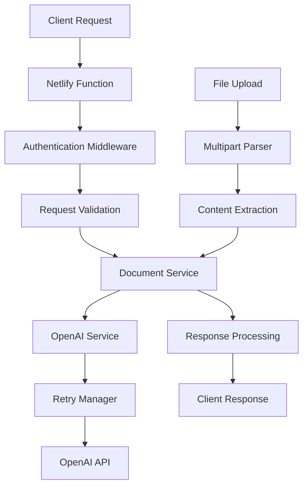

# 🤖 LLM Document Optimizer

A powerful serverless document optimization service that leverages Large Language Models (LLMs) to enhance, clarify, and consolidate documents. Built with TypeScript, Fastify, and deployed on Netlify Functions.

[](https://github.com/cr-nattress/llm-doc-optimizer)
[](https://github.com/cr-nattress/llm-doc-optimizer)
[](https://www.typescriptlang.org/)
[](LICENSE)

## 🌟 Features

### 📄 Document Processing
- **Multi-format Support**: TXT, PDF, DOCX, JSON, and more
- **Batch Processing**: Handle multiple documents simultaneously
- **Smart Type Detection**: Automatic detection of document types (transcripts, policies, emails, notes)

### 🎯 Optimization Types
- **Clarity Enhancement**: Improve readability and comprehension
- **Style Standardization**: Ensure consistent tone and formatting
- **Document Consolidation**: Merge multiple documents intelligently

### 🛡️ Enterprise-Ready
- **Robust Authentication**: API key validation with rate limiting
- **Error Handling**: Comprehensive error management with circuit breaker pattern
- **Retry Logic**: Exponential backoff for resilient API calls
- **Usage Tracking**: Token usage monitoring and cost calculation

### 🔍 Advanced Analytics
- **Entity Extraction**: Identify people, organizations, locations, dates
- **Topic Analysis**: Automatic topic detection and relevance scoring
- **Timeline Generation**: Extract chronological events from documents

### 🧪 Quality Assurance
- **206 Unit Tests**: Comprehensive test coverage
- **Type Safety**: Full TypeScript implementation with strict mode
- **Code Quality**: ESLint, Prettier, and Husky pre-commit hooks

## 🏗️ Architecture



### Tech Stack
- **Runtime**: Node.js 18+
- **Framework**: Fastify (high-performance web framework)
- **Language**: TypeScript with strict mode
- **Deployment**: Netlify Functions (serverless)
- **AI Integration**: OpenAI GPT-4/3.5-turbo
- **Testing**: Vitest with comprehensive coverage
- **Code Quality**: ESLint v9, Prettier, Husky

## 🚀 Quick Start

### Prerequisites
- Node.js 18+
- npm or yarn
- OpenAI API key

### Installation

```bash
# Clone the repository
git clone https://github.com/cr-nattress/llm-doc-optimizer.git
cd llm-doc-optimizer

# Install dependencies
npm install

# Set up environment variables
cp .env.example .env
# Edit .env with your OpenAI API key and other settings
```

### Environment Variables

```bash
# OpenAI Configuration
OPENAI_API_KEY=your_openai_api_key_here
OPENAI_ORGANIZATION=your_org_id_here  # Optional

# Authentication
JWT_SECRET=your_jwt_secret_here
API_KEYS=key1,key2,key3  # Comma-separated valid API keys

# Configuration
MAX_FILE_SIZE=10485760  # 10MB default
MAX_FILES=10
LOG_LEVEL=info
NODE_ENV=development
```

### Development

```bash
# Start development server
npm run dev

# Run tests
npm test

# Run tests with coverage
npm run test:coverage

# Build for production
npm run build

# Lint code
npm run lint

# Format code
npm run format
```

## 📚 API Documentation

### Base URL
- **Development**: `http://localhost:8888/.netlify/functions`
- **Production**: `https://your-site.netlify.app/.netlify/functions`

### Authentication
All requests require an API key in the header:
```
x-api-key: your_api_key_here
```

### Endpoints

#### POST `/optimize`
Optimize documents using LLM processing.

**Request Body (JSON):**
```json
{
  "documents": [
    {
      "name": "document.txt",
      "content": "Your document content here...",
      "type": "note"
    }
  ],
  "optimizationType": "clarity",
  "mode": "text",
  "model": "gpt-3.5-turbo"
}
```

**Request Body (Multipart):**
```bash
curl -X POST \
  -H "x-api-key: your_api_key" \
  -F "files=@document1.txt" \
  -F "files=@document2.pdf" \
  -F "optimizationType=clarity" \
  -F "mode=text" \
  http://localhost:8888/.netlify/functions/optimize
```

**Response:**
```json
{
  "success": true,
  "results": [
    {
      "originalFilename": "document.txt",
      "optimizedContent": "Enhanced document content...",
      "status": "fulfilled",
      "metadata": {
        "originalLength": 1500,
        "optimizedLength": 1200,
        "compressionRatio": 0.8,
        "processingTime": 2500,
        "model": "gpt-3.5-turbo",
        "tokenUsage": {
          "promptTokens": 400,
          "completionTokens": 300,
          "totalTokens": 700
        },
        "cost": 0.0014
      },
      "indexes": {
        "entities": [...],
        "topics": [...],
        "timeline": [...]
      }
    }
  ],
  "metadata": {
    "documentsProcessed": 1,
    "optimizationType": "clarity",
    "timestamp": "2024-01-20T10:30:00.000Z"
  }
}
```

#### GET `/optimize/health`
Health check endpoint.

**Response:**
```json
{
  "status": "ok",
  "timestamp": "2024-01-20T10:30:00.000Z",
  "environment": "production",
  "version": "1.0.0"
}
```

#### GET `/optimize/health/detailed`
Detailed health check with service status.

**Response:**
```json
{
  "status": "ok",
  "timestamp": "2024-01-20T10:30:00.000Z",
  "services": {
    "openai": {
      "circuitBreaker": "CLOSED",
      "failureCount": 0,
      "healthy": true
    }
  }
}
```

### Parameters

| Parameter | Type | Required | Description |
|-----------|------|----------|-------------|
| `documents` | Array | Yes | Array of document objects to process |
| `optimizationType` | String | Yes | Type of optimization: `clarity`, `style`, `consolidate` |
| `mode` | String | No | Output mode: `text`, `json`, `all` (default: `text`) |
| `model` | String | No | OpenAI model: `gpt-4`, `gpt-3.5-turbo`, `gpt-4-turbo` |
| `temperature` | Number | No | Model temperature (0-2, default: 0.1) |
| `maxTokens` | Number | No | Maximum tokens for response (default: 4000) |

### Document Types
- `transcript` - Meeting transcripts, recordings
- `policy` - Company policies, procedures
- `email` - Email communications
- `note` - General notes, memos

### Error Handling

All errors return a consistent format:
```json
{
  "success": false,
  "error": "Error message",
  "code": "ERROR_CODE",
  "timestamp": "2024-01-20T10:30:00.000Z"
}
```

Common error codes:
- `VALIDATION_ERROR` - Invalid request parameters
- `AUTHENTICATION_ERROR` - Invalid or missing API key
- `RATE_LIMIT_EXCEEDED` - Too many requests
- `PROCESSING_ERROR` - Document processing failed
- `EXTERNAL_SERVICE_ERROR` - OpenAI API error

## 🏗️ Project Structure

```
llm-doc-optimizer/
├── src/                     # Source code
│   ├── middleware/          # Express/Fastify middleware
│   │   └── error-handler.ts # Global error handling
│   ├── prompts/             # LLM prompt templates
│   │   ├── consolidate.prompt.ts
│   │   └── optimize.prompt.ts
│   ├── services/            # Business logic services
│   │   ├── document.service.ts    # Document processing
│   │   ├── openai.service.ts      # OpenAI integration
│   │   └── openai.mock.service.ts # Mock service for testing
│   ├── types/               # TypeScript type definitions
│   │   └── index.ts
│   └── utils/               # Utility functions
│       ├── auth.ts          # Authentication & rate limiting
│       ├── parser.ts        # File parsing utilities
│       ├── retry.ts         # Retry logic with circuit breaker
│       └── validation.ts    # Request validation
├── netlify/                 # Netlify Functions
│   └── functions/
│       └── optimize.ts      # Main API endpoint
├── test/                    # Test suites
│   ├── unit/                # Unit tests
│   └── e2e/                 # End-to-end tests
├── epics/                   # Development roadmap
├── .env.example             # Environment template
├── netlify.toml             # Netlify configuration
├── package.json             # Dependencies and scripts
├── tsconfig.json            # TypeScript configuration
└── vitest.config.ts         # Test configuration
```

## 🧪 Testing

The project includes comprehensive testing with 206 unit tests and 66.93% code coverage.

### Test Structure
```bash
test/
├── unit/                    # Unit tests
│   ├── api/                # API endpoint tests
│   ├── middleware/         # Middleware tests
│   ├── services/           # Service layer tests
│   └── utils/              # Utility function tests
├── e2e/                    # End-to-end tests
└── setup.ts               # Test configuration
```

### Running Tests

```bash
# Run all tests
npm test

# Run unit tests only
npm run test:unit

# Run E2E tests
npm run test:e2e

# Watch mode
npm run test:watch

# Coverage report
npm run test:coverage

# UI mode
npm run test:ui
```

### Test Coverage
- **Services**: 59.05% coverage
- **Utils**: 92.97% coverage
- **Middleware**: 100% coverage
- **Prompts**: 100% coverage

## 🚀 Deployment

### Netlify Deployment

1. **Connect Repository**:
   - Link your GitHub repository to Netlify
   - Set build command: `npm run build`
   - Set publish directory: `dist`

2. **Environment Variables**:
   Configure in Netlify dashboard:
   ```
   OPENAI_API_KEY=your_api_key
   JWT_SECRET=your_jwt_secret
   API_KEYS=comma,separated,keys
   NODE_ENV=production
   ```

3. **Deploy**:
   ```bash
   # Manual deployment
   npm run build
   netlify deploy --prod
   
   # Or push to main branch for auto-deployment
   git push origin main
   ```

### Manual Deployment

```bash
# Build the project
npm run build

# Deploy to Netlify
netlify deploy --prod --dir=dist
```

## 🔧 Configuration

### OpenAI Models

The service supports multiple OpenAI models:

| Model | Speed | Quality | Cost | Use Case |
|-------|-------|---------|------|----------|
| `gpt-3.5-turbo` | Fast | Good | Low | General optimization |
| `gpt-4` | Slow | Excellent | High | Complex documents |
| `gpt-4-turbo` | Medium | Excellent | Medium | Balanced performance |

### Rate Limiting

Default rate limits (configurable):
- **Requests**: 100 per hour per API key
- **Tokens**: 50,000 per hour per API key
- **File Size**: 10MB per file
- **Files**: 10 files per request

### Circuit Breaker

The retry system includes a circuit breaker with:
- **Failure Threshold**: 5 consecutive failures
- **Recovery Timeout**: 60 seconds
- **Retry Attempts**: 3 with exponential backoff

## 🤝 Contributing

1. **Fork the repository**
2. **Create a feature branch**: `git checkout -b feature/amazing-feature`
3. **Make your changes** with tests
4. **Run tests**: `npm test`
5. **Commit changes**: `git commit -m 'feat: add amazing feature'`
6. **Push to branch**: `git push origin feature/amazing-feature`
7. **Open a Pull Request**

### Development Guidelines

- Follow TypeScript strict mode
- Write tests for new features
- Use conventional commit messages
- Run `npm run lint` before committing
- Maintain code coverage above 65%

### Code Style

- **ESLint**: Enforced with pre-commit hooks
- **Prettier**: Auto-formatting
- **TypeScript**: Strict mode with explicit types
- **Naming**: camelCase for variables, PascalCase for types

## 📋 Roadmap

### Phase 4 Completion (In Progress)
- [ ] Enhanced rate limiting
- [ ] Token management system
- [ ] Additional model support
- [ ] Streaming responses
- [ ] Production monitoring

### Future Enhancements
- [ ] Document format conversion
- [ ] Batch processing API
- [ ] WebSocket support for real-time processing
- [ ] Dashboard UI
- [ ] Analytics and reporting
- [ ] Custom model fine-tuning

## 🐛 Troubleshooting

### Common Issues

**1. OpenAI API Errors**
```
Error: Invalid API key
```
- Verify `OPENAI_API_KEY` is set correctly
- Check API key permissions and billing

**2. Rate Limit Exceeded**
```
Error: Rate limit exceeded
```
- Wait for rate limit reset
- Upgrade OpenAI plan for higher limits

**3. File Upload Issues**
```
Error: File too large
```
- Check file size < 10MB
- Verify content type is supported

**4. Authentication Errors**
```
Error: Unauthorized
```
- Verify `x-api-key` header is included
- Check API key is in `API_KEYS` environment variable

### Debug Mode

Enable debug logging:
```bash
LOG_LEVEL=debug npm run dev
```

## 📄 License

ISC License - see [LICENSE](LICENSE) file for details.

## 🙏 Acknowledgments

- **OpenAI** - For providing powerful language models
- **Netlify** - For serverless hosting platform
- **Fastify** - For high-performance web framework
- **Vitest** - For testing framework

## 📞 Support

- 📧 **Issues**: [GitHub Issues](https://github.com/cr-nattress/llm-doc-optimizer/issues)
- 📖 **Documentation**: [Wiki](https://github.com/cr-nattress/llm-doc-optimizer/wiki)
- 💬 **Discussions**: [GitHub Discussions](https://github.com/cr-nattress/llm-doc-optimizer/discussions)

---

**Built with ❤️ using TypeScript, OpenAI, and Netlify**

*Generated with [Claude Code](https://claude.ai/code)*